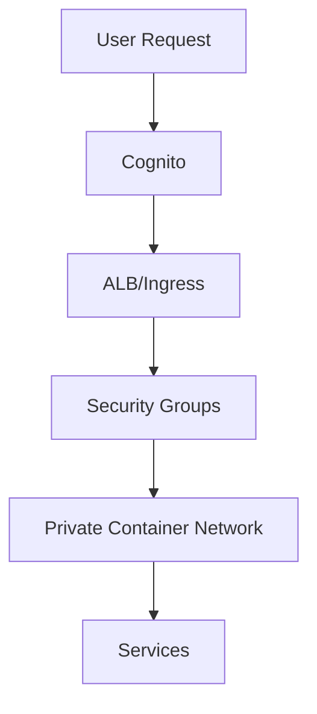

# Security Architecture

## Overview

The security architecture of Horizons OmniChat reflects our commitment to defense-in-depth principles. Rather than treating security as an add-on feature, we've woven it into every layer of the platform, creating multiple rings of protection that work together to safeguard your deployment.

## Authentication & Authorization

Our authentication and authorization framework adapts to your deployment mode while maintaining consistent security principles. Let's explore how this works across different scenarios:

### Local Mode Security

In local deployments, we focus on providing robust security without complexity. The WebUI authentication system delivers:

- Strong basic authentication with configurable credentials
- Session-based authentication for consistent user experience
- Role-based access control (RBAC) for granular permissions

### Hybrid Mode Enhancements

When deploying in hybrid mode, we layer additional security features on top of our local security foundation:

- Seamless AWS IAM integration for Bedrock access
- Token-based authentication for enhanced security
- Fine-grained API permissions management

### AWS Mode Enterprise Security

In AWS deployments, we leverage the full power of cloud security services:

- AWS Cognito user pools for robust identity management
- JWT token validation for secure authentication
- Multi-factor authentication (MFA) support **(ENTERPRISE)**
- SAML/OAuth2 integration capabilities with Cognito
- Enhanced audit logging capabilities **(ENTERPRISE)**


### Enterprise Security Guardrails

Our enterprise security guardrails provide additional layers of protection:

**Guardrails Layer (ENTERPRISE)** :
- Functional Security Layer (Level 1)
  - Sophisticated input validation for LLM prompts
  - Topic-specific security controls
  - Response filtering and guidance
  - Advanced context management
  - Comprehensive model behavior monitoring
  - Automated privacy and compliance checks

- LLM Product Protection (Level 2)
  - Security-focused prompt engineering
  - Advanced output validation and quality control

## Network Security: Defense in Depth

Our network security architecture implements multiple layers of protection, ensuring that your data remains secure whether at rest or in transit. Let's explore how we achieve this:

### Container Security Architecture

At the heart of our network security lies a sophisticated container security model:



This architecture ensures that each request passes through multiple security checkpoints before reaching your services.

### Comprehensive Network Controls

We implement enterprise-grade network security through:

- State-of-the-art TLS 1.3 encryption for all communications
- Complete network isolation between components
- Granular security groups and NACLs for access control
- Protected compute resources in private subnets
- Secure VPC endpoints for AWS service access

## Data Security

### Data at Rest
- Database encryption (AES-256)
- Volume encryption (EBS/EFS)
- Key management with AWS KMS
- Secure secret storage

### Data in Transit
- TLS for all API communications
- Mutual TLS between services
- Certificate rotation
- Perfect forward secrecy

### Data Classification

| **Type** | **Examples** | **Protection** |
|------|----------|------------|
| User Data | Chat history, preferences | Encrypted, access controlled |
| System Data | Logs, metrics | Restricted access |
| Configuration | API keys, credentials | Encrypted, versioned |


### Session Management
- Secure session handling
- Automatic session expiration
- Concurrent session limits
- Session invalidation on logout

## Compliance & Auditing **(ENTERPRISE)** 

### Audit Logging
- Authentication events
- Authorization decisions
- Data access logs
- System changes
- API usage

### Compliance Controls
- GDPR compliance features
- Data retention policies
- Data export capabilities
- Privacy controls

## Threat Protection **(ENTERPRISE)** 

Add WAF to infrastructure

### Application Security
- Input validation
- Output encoding
- CSRF protection
- XSS prevention
- Rate limiting

### Infrastructure Security
- Container hardening
- Regular security updates
- Vulnerability scanning
- Intrusion detection

## Security Monitoring **(ENTERPRISE)** 

### Real-time Monitoring 

```yaml
Metrics:
  - Authentication failures
  - Authorization violations
  - API usage patterns
  - Network anomalies
```

### Alerting
- Security event alerts
- Compliance violations
- Resource access attempts
- System anomalies


## Next Steps

- Review [Operations Security](../operations/security.md)
- Implement [Security Monitoring](../operations/monitoring.md)
- Configure [Authentication](../operations/configuration.md#authentication)


