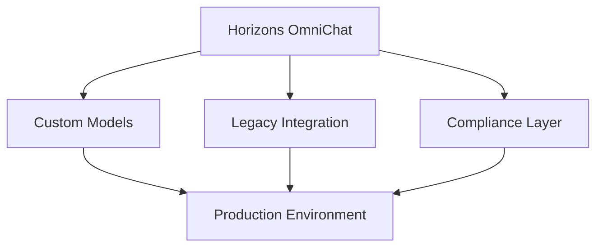

# Community Showcase

## Featured Implementations

### Enterprise Deployments

#### Financial Services
- **Global Investment Bank**
  - Hybrid deployment with custom models
  - 10,000+ daily users
  - Integration with internal knowledge base
  - Custom compliance controls

#### Healthcare
- **Regional Hospital Network**
  - AWS deployment with HIPAA compliance
  - Secure medical information processing
  - Integration with medical systems
  - Custom healthcare models

### Government & Public Sector

#### Smart City Initiative
- **European Municipality**
  - Local deployment for data sovereignty
  - Citizen service automation
  - Multi-language support
  - Privacy-first architecture

#### Educational Institution
- **Major University**
  - Hybrid deployment
  - Research assistance
  - Student support services
  - Custom academic models

## Community Projects

### Open Source Extensions

#### Data Analysis Plugin (Enterprise mode)
- Advanced data visualization, horizon data analytics
- Custom reporting tools
- Integration with popular BI tools

#### Security Enhancement Suite (Enterprise mode)
- Additional security controls, horizons security
- Enhanced audit logging
- Compliance reporting tools

## Custom Integrations

### Enterprise Systems (Enterprise mode)
- SAP Integration
- Salesforce Connector
- Microsoft Teams Bot
- Slack Integration

### Industry Solutions
- Legal Document Analysis
- Medical Record Processing
- Financial Advisory
- Educational Support

## Applications

### Case Study: Financial Services

#### Challenge
- Need for secure, compliant chatbot
- Integration with legacy systems
- Multi-language support
- High performance requirements

#### Solution

#### Benefits
- Reduction in response time
- User satisfaction
- Cost reduction
- Full compliance maintenance

### Case Study: Healthcare

#### Challenge
- HIPAA compliance requirements
- Medical terminology support
- Integration with EHR systems
- 24/7 availability needs

#### Solution
- AWS deployment with enhanced security
- Custom medical models
- HL7 integration layer
- High availability setup

#### Benefits
- Accuracy in medical queries
- Reduction in wait times
- HIPAA compliance
- Improved patient satisfaction

## Next Steps

1. Review [Contributing Guide](../development/contributing.md)
2. Join [Community Discussions](https://github.com/evereven-tech/horizons-omnichat/discussions)
3. Submit your [Project Showcase](https://github.com/evereven-tech/horizons-omnichat/issues/new?template=showcase.md)


