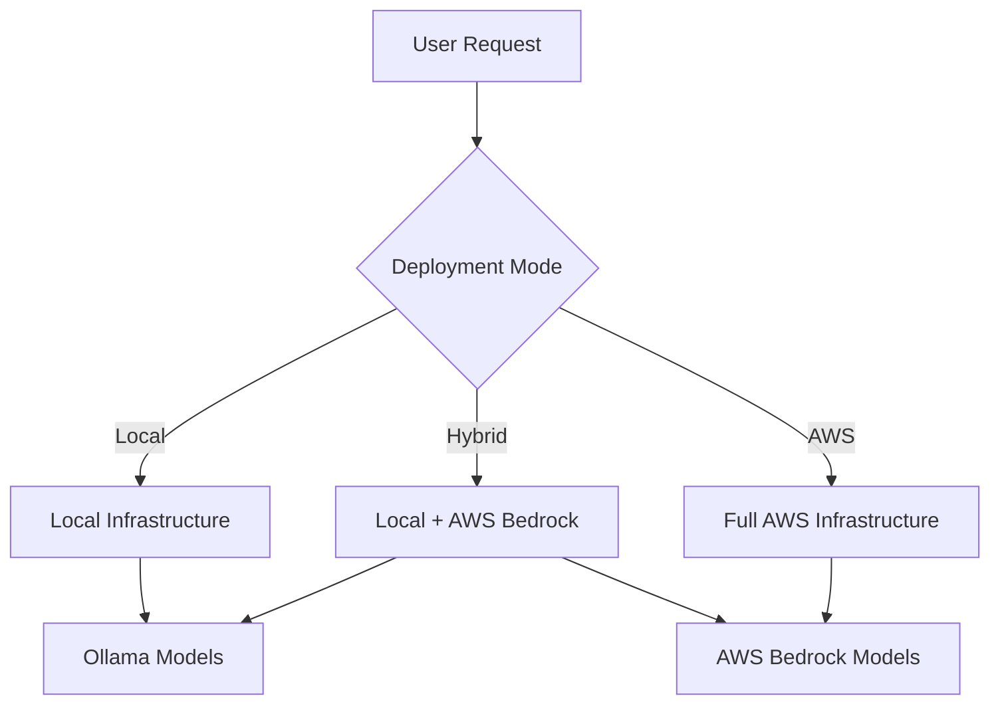

# Deployment Options

Horizons OmniChat offers flexible deployment options to meet different organizational needs and requirements.

## Available Deployment Modes

### 1. Local Mode

- **Best for**: Development, testing, and privacy-focused deployments
- **Key Features**:
  - Complete local deployment
  - No cloud dependencies
  - Full data privacy
  - Local model inference via Ollama
- **Learn More**: [Local Deployment Guide](local.md)

### 2. Hybrid Mode

- **Best for**: Production environments needing cloud LLM capabilities
- **Key Features**:
  - Local infrastructure
  - AWS Bedrock integration
  - Mixed model support (local + cloud)
  - Cost-effective scaling
- **Learn More**: [Hybrid Deployment Guide](hybrid.md)

### 3. AWS Mode

- **Best for**: Enterprise-scale deployments
- **Key Features**:
  - Full cloud infrastructure
  - Auto-scaling capabilities
  - High availability
  - Enterprise security features
- **Learn More**: [AWS Deployment Guide](aws.md)

### 4. Kubernetes Mode (Coming Soon)
- **Best for**: Container-orchestrated environments
- **Key Features**:
  - Kubernetes native deployment
  - Helm charts
  - Operator support
  - Cloud-agnostic
- **Learn More**: [Kubernetes Deployment Guide](kubernetes.md)

## Deployment Comparison

| Feature | Local | Hybrid | AWS |
|---------|--------|---------|-----|
| Infrastructure | Self-hosted | Self-hosted | AWS Cloud |
| Model Support | Ollama | Ollama + Bedrock | Ollama + Bedrock |
| Scaling | Manual | Manual | Auto-scaling |
| High Availability | No | No | Optional |
| Security | Basic | Enhanced | Enterprise |
| Cost | Low | Medium | Usage-based |
| Setup Complexity | Simple | Moderate | Advanced |

## Architecture Overview

## Choosing a Deployment Mode

### Consider Local Mode if you:
- Need complete data privacy
- Are developing or testing
- Have limited cloud budget
- Want simple setup and maintenance

### Consider Hybrid Mode if you:
- Need both local and cloud models
- Want cost-effective scaling
- Have existing infrastructure
- Need flexible deployment options

### Consider AWS Mode if you:
- Need enterprise-grade features
- Need security advanced features
- Want automated scaling
- Require high availability
- Have cloud-first strategy

## Deployment Requirements

### Local Mode
- Docker/Podman
- 8GB RAM minimum
- 20GB storage
- Optional: NVIDIA GPU

### Hybrid Mode
- Local Mode requirements
- AWS account
- AWS Bedrock access
- Network connectivity

### AWS Mode
- AWS account
- Terraform installed
- AWS CLI configured
- Required AWS services enabled

## Getting Started

1. Review [System Requirements](../getting-started/requirements.md)
2. Choose your deployment mode
3. Follow the corresponding deployment guide:
   - [Local Deployment](local.md)
   - [Hybrid Deployment](hybrid.md)
   - [AWS Deployment](aws.md)

## Next Steps

- Review [Security Considerations](../security/overview.md)
- Set up [Monitoring](../operations/monitoring.md)
- Configure [Backup Strategy](../operations/backup.md)
- Join our [Community](../community/)


