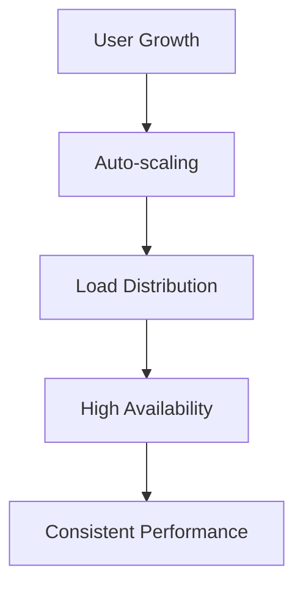

# Features That Make Horizons Stand Out

Discover why organizations choose Horizons OmniChat for their conversational AI needs. Our platform combines enterprise-grade capabilities with unmatched flexibility and control.

## 🎯 Core Capabilities

### Privacy-First Architecture
> 💡 **Tip**: Unlike other solutions that send your data to external services, Horizons keeps your data under your complete control.

Your data never leaves your infrastructure. Period. We've built Horizons with privacy at its core:
- Deploy entirely within your infrastructure
- Keep sensitive conversations private
- Maintain full data sovereignty
- Choose where your data resides

### Flexible Deployment Options
> ⚠️ **Important**: Start with Local mode to experiment, then scale up to Hybrid or AWS as your needs grow.

Deploy Horizons your way:
- **Local Mode**: Perfect for development and testing
  - Complete privacy
  - No cloud dependencies
  - Ideal for sensitive data
  
- **Hybrid Mode**: Best of both worlds
  - Local infrastructure control
  - Access to powerful cloud models
  - Cost-effective scaling
  
- **AWS Mode**: Enterprise-grade deployment
  - Full cloud infrastructure
  - Auto-scaling capabilities
  - High availability
  
- **Kubernetes Mode** (Coming Soon)
  - Cloud-agnostic deployment
  - Advanced orchestration
  - Enhanced scalability

## 🚀 Advanced Features

### Multi-Model Support
Mix and match models to suit your needs:

| Local Models (via Ollama) | Cloud Models (via AWS Bedrock) |
|--------------------------|-------------------------------|
| Llama 2 | Claude (Anthropic) |
| Mistral | Titan (Amazon) |
| TinyLlama | Jurassic (AI21) |
| Deepseek | Command (Cohere) |
| Salamandra (ALIA) | Nova (Amazon) |

> 💫 **Pro-tip**: Combine local models with cloud models for enhanced capabilities.

### Enterprise-Grade Security
> 🔒 **Security Note**: Every layer of Horizons is designed with security in mind.

- End-to-end encryption
- Role-based access control
- Audit logging
- Compliance features
- Network isolation
- Advanced authentication options

### Scalability & Performance
Built to grow with your needs:

- Automatic scaling (Cloud mode)
- Load balancing
- Resource optimization
- Performance monitoring
- GPU acceleration support

## 💼 Business Benefits

### Cost Optimization
> 💰 **Cost Tip**: Start with Local mode for development, then scale with Hybrid mode for more models.

- Pay only for what you use
- Mix local and cloud models
- Optimize resource usage
- Control cloud costs

### Testing Chatbots Experience
> 🛠️ **Dev Tip**: Our comprehensive API documentation and SDKs make integration a breeze.

- Clear documentation
- Active community

## 🎯 Use Cases

#### Healthcare Applications
- **Patient Support**: 24/7 patient information assistance
- **Clinical Documentation**: Automated medical record analysis
- **Treatment Guidelines**: Quick access to medical protocols
- **Compliance**: HIPAA-compliant deployment options

#### Financial Services
- **Risk Analysis**: Automated risk assessment
- **Fraud Detection**: Pattern recognition in transactions
- **Customer Service**: Automated financial advice
- **Compliance**: SEC and FINRA compliant deployments

#### Government Systems
- **Citizen Services**: Automated public service support
- **Document Processing**: Government document analysis
- **Policy Support**: Legislative and policy guidance
- **Security**: ENS and FedRAMP compliance features

#### Legal Assistance
- **Case Research**: Automated legal research assistance
- **Document Review**: Contract and legal document analysis
- **Compliance Check**: Regulatory compliance verification
- **Risk Assessment**: Legal risk evaluation

#### Internal Knowledge Base
- **Document Processing**: Automatically process and index company documentation
- **Smart Search**: Natural language queries across all company resources
- **Knowledge Extraction**: Convert unstructured data into actionable insights
- **Real-time Updates**: Continuous learning from new documentation

#### Customer Support Automation
- **24/7 Support**: Automated responses to common customer inquiries
- **Multi-language Support**: Automatic translation and response in customer's language
- **Ticket Triage**: Intelligent routing of complex issues to human agents
- **Response Consistency**: Standardized answers across all channels

#### Employee Assistance
- **HR Support**: Automated responses to common HR queries
- **IT Helpdesk**: First-line technical support automation
- **Onboarding**: Interactive new employee guidance
- **Policy Guidance**: Instant access to company policies and procedures

#### Document Analysis
- **Contract Review**: Automated contract analysis and summary
- **Compliance Checking**: Regulatory compliance verification
- **Data Extraction**: Key information extraction from documents
- **Report Generation**: Automated report creation and analysis

### Development & Testing
> 🔧 **Pro Tip**: Start with Local mode for development and migrate to Hybrid/AWS for production.

#### Model Experimentation
- **Quick Iteration**: Rapid testing of different models
- **Performance Comparison**: Side-by-side model evaluation
- **Custom Training**: Fine-tune models with domain data
- **Cost Analysis**: Compare model efficiency and costs

#### Prototype Development
- **Fast MVP**: Quick prototype deployment
- **Feature Testing**: Rapid feature validation
- **User Feedback**: Quick iteration based on feedback

### Secure Deployments
> 🔒 **Security Note**: All deployments include enterprise-grade security features.

## 🚀 Getting Started

Ready to experience these features? Follow our quick start guides:

1. [Check Requirements](requirements.md)
2. [Installation/Deployment Guide](../deployment/index.md)

> 🌟 **Success Tip**: Our [Community Edition](../community/) is perfect for evaluating all these features in action.

## Enterprise Features

For organizations needing additional capabilities, our Enterprise Edition includes:

- evereven managed services: 
	- Advanced premium support 
	- Delegated management of your infrastructure
- Professional fine tuning services
	- Performance tuning
	- High Availability infrastructure for business requirements
- Visual branding customisation layer
- Advanced security to meet required regulatory compliance
- Augmentation with business document databases 
- Integration with business SSO
- Integration with other third party platforms
- Product deployment and Chatbot management training
- Professional consulting services
- Integration with customer applications

> 🤝 **Enterprise Tip**: Contact our [Enterprise Team](https://evereven.tech/en/connect/) to discuss your specific needs.

## Next Steps

- [Explore Deployments](../deployment/index.md)
- [Join Our Community](../community/index.md)
- [Contact Enterprise Sales](https://evereven.tech/en/connect/)


