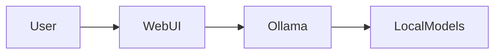
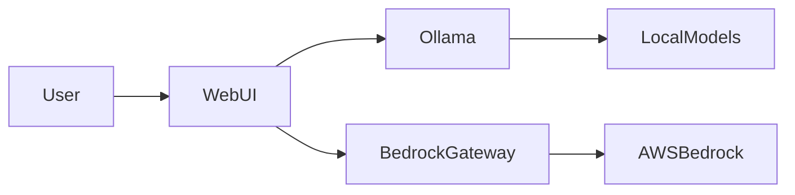
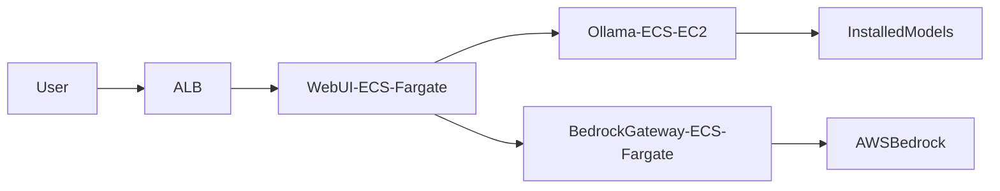

# Architecture Components

## Core Components Overview

### 1. Open WebUI
- **Purpose**: Frontend interface and chat management
- **Key Features**:
  - User interface for chat interactions
  - Session management
  - Model selection and configuration
  - Chat history and conversation management
- **Technologies**:
  - Svelte frontend
  - FastAPI backend
  - PostgreSQL for persistence

### 2. Ollama
- **Purpose**: Local model serving and inference
- **Key Features**:
  - Local model management
  - Model inference and generation
  - Model quantization and optimization
  - GPU acceleration support
- **Supported Models**:
  - Llama 2
  - Mistral
  - TinyLlama
  - Deepseek
  - Qwen
  - ALIA/Salamandra
  - Custom models

### 3. Bedrock Gateway
- **Purpose**: AWS Bedrock integration layer
- **Key Features**:
  - API compatibility layer
  - Model routing and load balancing
  - Request/response transformation
  - Authentication and rate limiting
- **Supported Models**:
  - Claude (Anthropic)
  - Titan (Amazon)
  - Nova (Amazon)
  - Jurassic (AI21)
  - Command (Cohere)

## Component Interactions

### Local Mode

### Hybrid Mode

### AWS Mode

## Component Configuration

Check relevant section on [Deployment Options](../deployment/)

## Data Flow

### 1. Chat Request Flow
1. User sends message through WebUI
2. WebUI validates and processes request
3. Request routed to appropriate backend (Ollama/Bedrock)
4. Response generated and returned
5. Chat history stored in PostgreSQL

### 2. Model Management Flow
1. Administrator selects models to install
2. Ollama downloads models from hub
3. Models optimized for local hardware
4. Model metadata stored in database

### 3. Authentication Flow
1. User authentication request
2. Credentials validated
3. Session token generated
4. Token used for subsequent requests

## Component Scaling

### Local/Hybrid Mode
- Vertical scaling of Ollama for better performance
- PostgreSQL connection pooling
- Redis caching (optional)

### AWS Mode
- ECS Auto Scaling
- RDS scaling
- ALB request distribution
- EFS for model storage

## Component Monitoring

### Health Checks
- WebUI: `/health`
- Ollama: `/api/tags`
- Bedrock Gateway: `/health`

### Metrics
- Request latency
- Model inference time
- Memory usage
- GPU utilization
- Database connections

## Security Considerations

### Component Security
- TLS encryption between components
- API key authentication
- Rate limiting
- Input validation

## Next Steps

- Review [Security Architecture](security.md)
- Explore [Deployment Options](../deployment/)
- Learn about [Operations](../operations/)


