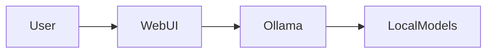
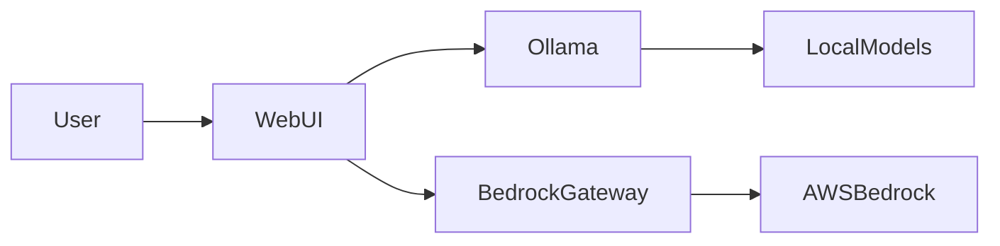
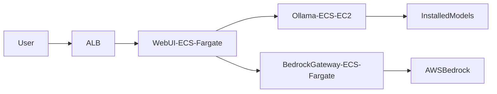

# Architecture Components

Understanding the components that make up Horizons OmniChat is crucial for successful deployment and operation. Let's explore how each piece works together to create a powerful, flexible chatbot platform.

## Core Components: The Building Blocks of Horizons

At its heart, Horizons consists of three primary components, each carefully designed to handle specific aspects of the platform's functionality. Let's dive into each one:

### Open WebUI: Your Gateway to AI Interaction

Open WebUI serves as more than just an interface - it's the command center of your Horizons deployment. Built with modern technologies, it provides a seamless experience for both users and administrators.

At its foundation, Open WebUI combines:
- A responsive Svelte frontend that delivers lightning-fast interactions
- A robust FastAPI backend handling complex operations
- PostgreSQL persistence ensuring no valuable data is lost
- Real-time WebSocket communications for instant responses

This powerful combination enables:
- Intuitive chat interactions that feel natural and responsive
- Comprehensive session management for user continuity
- Flexible model selection and configuration options
- Detailed chat history and conversation management

### Ollama: The Local Intelligence Engine

Ollama represents our commitment to providing powerful AI capabilities directly within your infrastructure. Think of it as your personal AI powerhouse, capable of running sophisticated language models while maintaining complete data privacy.

Key capabilities include:
- Sophisticated model management for multiple AI models
- Optimized inference for maximum performance
- Intelligent resource utilization including GPU acceleration
- Support for a growing library of models including:
  - Llama 2 for general-purpose applications
  - Mistral for enhanced reasoning capabilities
  - TinyLlama for resource-constrained environments
  - Deepseek for specialized applications
  - Qwen for multilingual support
  - ALIA/Salamandra for Spanish-language excellence
  - Custom models for specific use cases

### Bedrock Gateway: Your Bridge to Cloud AI

The Bedrock Gateway exemplifies our approach to hybrid capabilities, providing seamless access to AWS's powerful AI models while maintaining security and control. This component acts as an intelligent intermediary, handling:
- Sophisticated API compatibility and transformation
- Intelligent request routing and load distribution
- Robust authentication and rate management
- Access to premium models including:
  - Claude (Anthropic) for advanced reasoning
  - Titan (Amazon) for general applications
  - Nova (Amazon) for specialized tasks
  - Jurassic (AI21) for creative content
  - Command (Cohere) for business applications

## Component Interactions: A Symphony of Services

Understanding how these components work together is crucial for optimal deployment. Let's explore the interaction patterns across different deployment modes:

### Local Mode: Privacy-First Architecture

In Local mode, components interact within your infrastructure, ensuring complete data privacy while maintaining full functionality. This architecture is perfect for:
- Development and testing environments
- Privacy-sensitive deployments
- Offline operations
- Initial evaluation and testing

### Hybrid Mode: The Best of Both Worlds

Hybrid mode represents our flexible approach to deployment, combining local processing power with cloud capabilities. This architecture excels in:
- Production environments needing both local and cloud models
- Scenarios requiring enhanced model variety
- Deployments with specific data sovereignty requirements
- Cost-optimized production environments

### AWS Mode: Enterprise-Scale Architecture

AWS mode delivers enterprise-grade scalability and reliability. This sophisticated architecture provides:
- Automatic scaling capabilities
- High availability configurations
- Enterprise-grade security
- Comprehensive monitoring and management

## Understanding Data Flows: How Information Moves Through Horizons

The true power of Horizons lies not just in its components, but in how they work together to process and manage information. Let's explore the key data flows that make everything work:

### Chat Request Flow: From User to AI and Back

When a user interacts with Horizons, a sophisticated sequence of events occurs:

1. The user's message begins its journey through WebUI
2. Our validation layer ensures the request meets all security and format requirements
3. Smart routing directs the request to either Ollama or Bedrock based on the selected model
4. The AI model processes the request and generates a response
5. The interaction is securely stored in PostgreSQL for future reference

This entire process happens in milliseconds, providing a seamless experience while maintaining security and reliability.

### Model Management: Keeping AI Updated and Optimized

Our model management flow ensures you always have the right AI models ready when needed:

1. Administrators can easily select and manage models through the intuitive interface
2. Ollama handles the secure download and installation of models
3. Each model is automatically optimized for your specific hardware configuration
4. Detailed model metadata is maintained for optimal performance and management

### Authentication: Keeping Your System Secure

Security is paramount in Horizons, and our authentication flow reflects this:

1. Every user request goes through robust authentication
2. Credentials are validated against your security policies
3. Secure session tokens are generated for ongoing interactions
4. All subsequent requests are validated using these tokens

This ensures that every interaction is secure while maintaining a smooth user experience.

## Scaling for Growth: Adapting to Your Needs

As your usage grows, Horizons grows with you. Our scaling capabilities ensure your system maintains performance under any load:

### Local and Hybrid Scaling: Optimizing Local Resources

In Local and Hybrid modes, we focus on maximizing your infrastructure's potential:
- Intelligent vertical scaling of Ollama to leverage available resources
- Sophisticated PostgreSQL connection pooling for optimal database performance
- Optional Redis caching for enhanced response times
- Resource-aware model loading and unloading

### AWS Mode: Enterprise-Grade Scalability

AWS mode unleashes the full power of cloud scaling:
- Automatic ECS scaling based on demand
- Intelligent RDS scaling for database operations
- Smart request distribution through Application Load Balancers
- Efficient model storage using EFS

## Keeping Everything Healthy: Monitoring and Maintenance

Maintaining a healthy system requires vigilant monitoring. Horizons provides comprehensive health monitoring capabilities:

### Health Checks: Your Early Warning System

Each component provides detailed health information:
- WebUI status through `/health` endpoint
- Ollama health via `/api/tags`
- Bedrock Gateway monitoring via `/health`

### Performance Metrics: Understanding Your System

We track crucial metrics to ensure optimal performance:
- Real-time request latency monitoring
- Model inference time tracking
- Detailed memory usage analysis
- GPU utilization metrics
- Database connection management

## Securing Your Deployment: A Multi-Layered Approach

Security isn't just a feature in Horizons - it's a fundamental aspect of every component:

### Component-Level Security

We implement multiple security layers:
- Enterprise-grade TLS encryption between all components
- Robust API key authentication
- Intelligent rate limiting to prevent abuse
- Comprehensive input validation at all entry points

## Your Next Steps

Ready to dive deeper? Here's where to go next:

- Understand our complete [Security Architecture](security.md)
- Learn about different [Deployment Options](../deployment/)
- Master [Operations](../operations/) for your deployment


