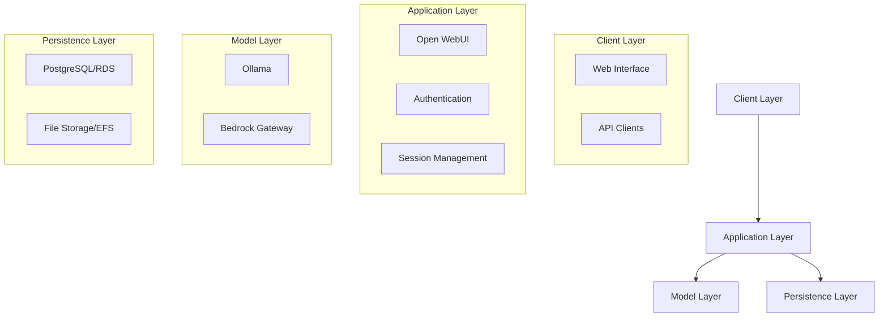
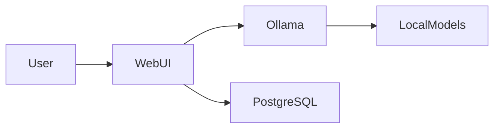
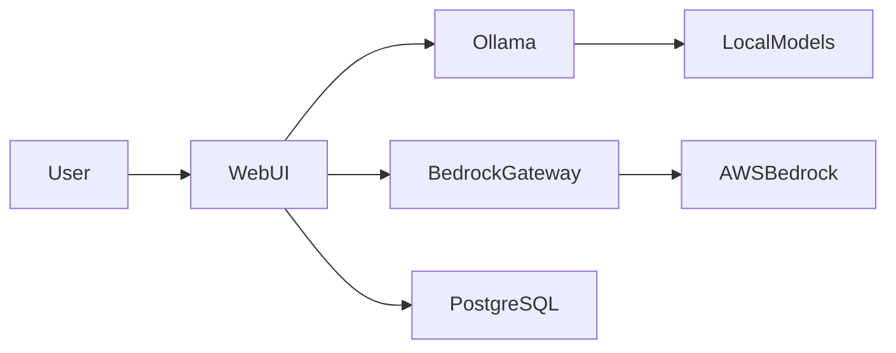
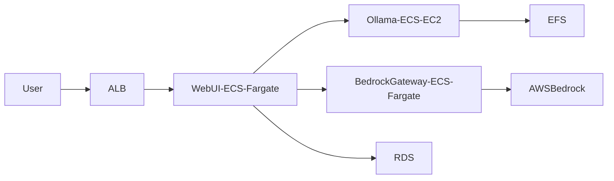
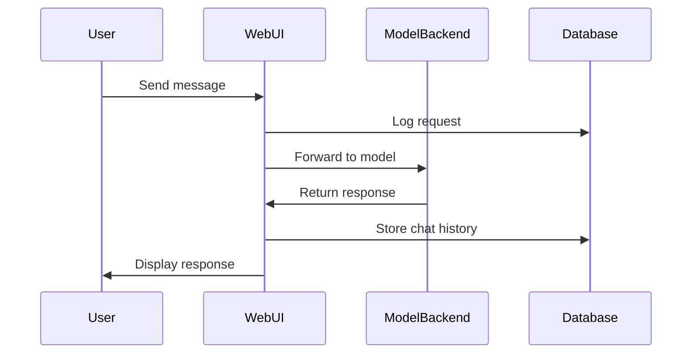
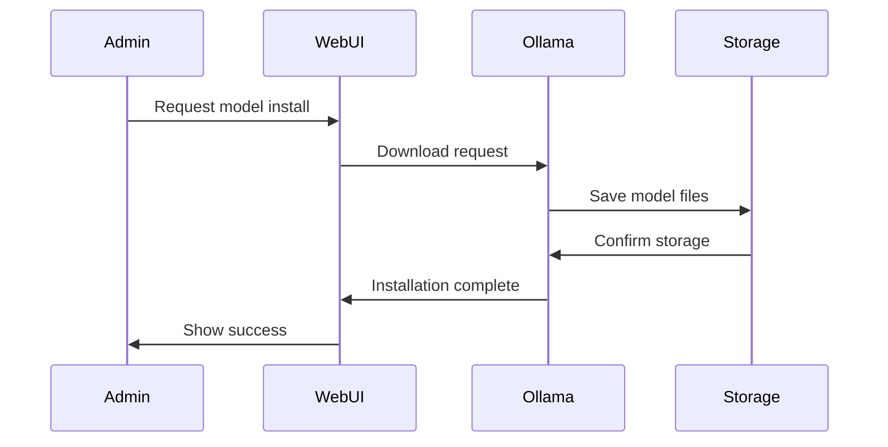

# Architecture Overview

## System Architecture

Horizons OmniChat is designed with modularity and flexibility in mind, supporting multiple deployment modes while maintaining consistent functionality and security.

### Core Components

### Component Details

#### 1. Open WebUI
- **Purpose**: Main user interface and application logic
- **Features**:
  - Chat interface
  - Model management
  - User authentication
  - Session handling
- **Technology Stack**:
  - Svelte frontend
  - FastAPI backend
  - WebSocket support
  - REST APIs

#### 2. Ollama
- **Purpose**: Local model serving and inference
- **Features**:
  - Model management
  - Inference optimization
  - GPU acceleration
  - Custom model support
- **Supported Models**: Llama 2, Mistral, TinyLlama, etc.

#### 3. Bedrock Gateway
- **Purpose**: AWS Bedrock integration
- **Features**:
  - Model routing
  - Request transformation
  - Response handling
  - Authentication
- **Supported Models**: Claude, Titan, Jurassic, etc.

## Deployment Architectures

### 1. Local Mode

- **Components**:
  - Open WebUI container
  - Ollama container
  - PostgreSQL container
- **Features**:
  - Complete privacy
  - No cloud dependencies
  - Local model inference
  - Simplified deployment

### 2. Hybrid Mode

- **Components**:
  - All Local Mode components
  - Bedrock Gateway container
  - AWS Bedrock integration
- **Features**:
  - Mixed model support
  - Cloud model access
  - Local infrastructure control
  - Cost optimization

### 3. AWS Mode

- **Components**:
  - Application Load Balancer
  - ECS Fargate for WebUI
  - ECS EC2 for Ollama
  - RDS for PostgreSQL
  - EFS for model storage
- **Features**:
  - Auto-scaling
  - High availability
  - Managed services
  - Enterprise security

## Data Flow

### 1. Chat Request Flow

### 2. Model Management Flow

## Security Architecture

- **Authentication**: Role-based access control
- **Encryption**: TLS for all communications
- **Data Protection**: Encrypted storage
- **Network Security**: Private subnets and security groups
- **Audit**: Comprehensive logging

## Performance Considerations

### 1. Resource Requirements
- **CPU**: Model inference, request handling
- **Memory**: Model loading, session management
- **Storage**: Model files, chat history
- **Network**: API communications, model downloads

### 2. Optimization Strategies
- Model quantization
- Response caching
- Connection pooling
- Load balancing

## Next Steps

- Review detailed [Component Architecture](components.md)
- Explore [Security Architecture](security.md)
- Check [Deployment Options](../deployment/)
- Learn about [Operations](../operations/)


