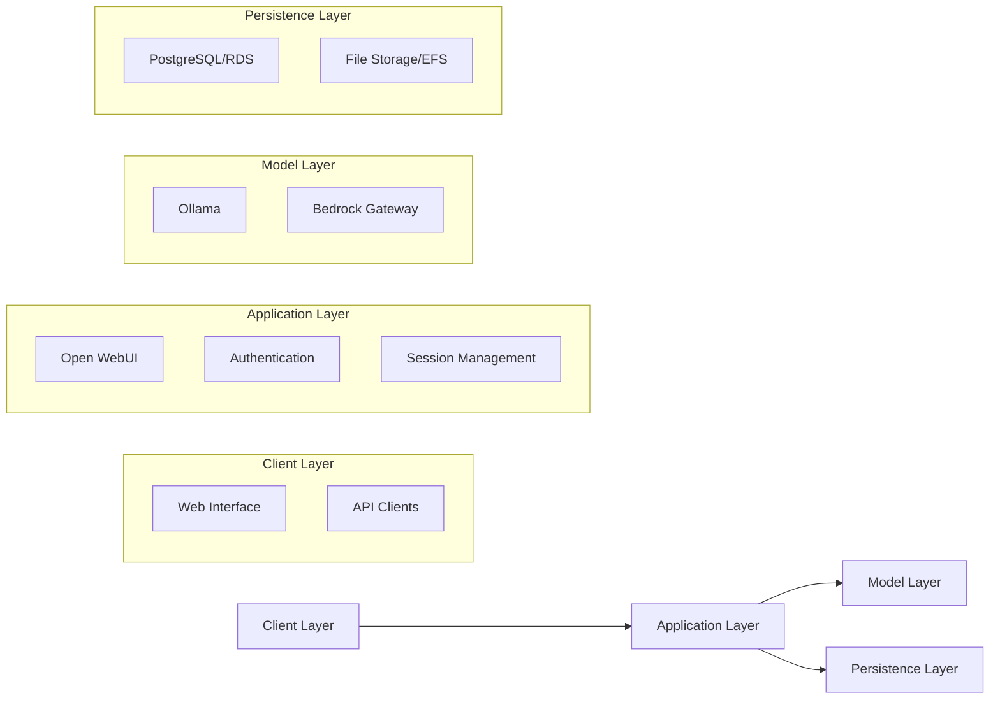

# Architecture Overview

## System Architecture

Horizons OmniChat is engineered with modularity and flexibility at its core, enabling a robust platform that adapts to diverse deployment scenarios while maintaining consistent functionality and security. Our architecture is designed to scale from individual development environments to enterprise-grade deployments without compromising on performance or security features.

### Core Components

The system is thoughtfully divided into four interconnected layers, each designed to handle specific aspects of the platform's functionality while working in harmony with the others:

### Component Details

#### 1. Open WebUI
Open WebUI serves as the primary interface and application logic hub of Horizons. Built with modern technologies, it provides a seamless experience for both users and administrators. The component leverages Svelte for the frontend, delivering exceptional performance through its compiled approach, while FastAPI powers the backend with its high-performance asynchronous capabilities. This combination enables:

- A responsive and intuitive chat interface that adapts to various use cases
- Comprehensive model management capabilities for administrators
- Robust user authentication and session management
- Real-time communication through WebSocket support
- RESTful APIs for seamless integration with external systems

#### 2. Ollama
Ollama functions as our local model serving engine, providing sophisticated AI capabilities directly within your infrastructure. It's designed to optimize model performance while maintaining flexibility:

- Efficient model management with support for multiple model formats
- Intelligent inference optimization based on available hardware
- GPU acceleration capabilities for enhanced performance
- Extensive support for custom models and fine-tuning
- Advanced caching mechanisms for improved response times

#### 3. Bedrock Gateway
The Bedrock Gateway represents our bridge to AWS's powerful AI capabilities, thoughtfully designed to provide seamless access to cloud-based models while maintaining security and performance:

- Intelligent request routing and load balancing
- Sophisticated request transformation for optimal model interaction
- Robust error handling and retry mechanisms
- Enterprise-grade authentication and security controls
- Comprehensive monitoring and logging capabilities

## Deployment Architectures

### 1. Local Mode

Local mode provides a complete, self-contained environment perfect for development, testing, and privacy-focused deployments. This architecture ensures:

- Complete data sovereignty with all components running locally
- Simplified deployment and maintenance procedures
- Perfect for development and testing environments
- Ideal for organizations with strict data privacy requirements

### 2. Hybrid Mode

- **Components**:
  - All Local Mode components
  - Bedrock Gateway container
  - AWS Bedrock integration
- **Features**:
  - Mixed model support
  - Cloud model access
  - Local infrastructure control
  - Cost optimization

### 3. AWS Mode

- **Components**:
  - Application Load Balancer
  - ECS Fargate for WebUI
  - ECS EC2 for Ollama with GPU Optimisation
  - RDS for PostgreSQL
  - EFS for model storage
- **Features**:
  - Auto-scaling **(ENTERPRISE)**
  - High availability **(ENTERPRISE)**
  - Managed services 
  - Enterprise security **(ENTERPRISE)**

## Data Flow

### 1. Chat Request Flow

### 2. Model Management Flow

## Next Steps

- Review detailed [Component Architecture](components.md)
- Explore [Security Architecture](security.md)
- Check [Deployment Options](../deployment/)
- Learn about [Operations](../operations/)


