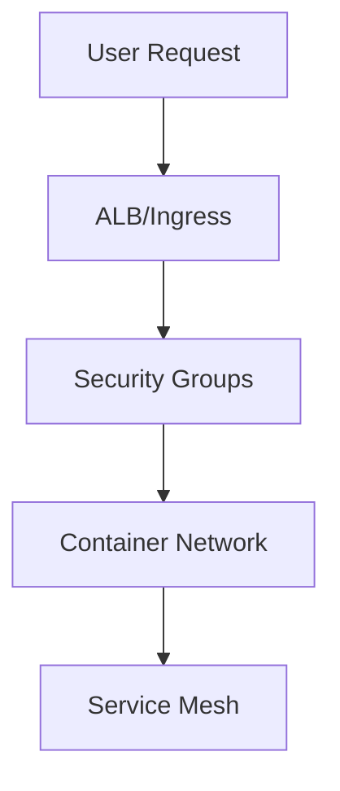

# Security Architecture

## Overview

The security architecture of Horizons OmniChat is designed with a defense-in-depth approach, implementing multiple layers of security controls across all deployment modes.

## Authentication & Authorization

### Local Mode
- Basic authentication with configurable credentials
- Session-based authentication
- Role-based access control (RBAC)
- API key authentication for programmatic access

### Hybrid Mode
All Local Mode features plus:
- AWS IAM integration for Bedrock access
- Token-based authentication
- Fine-grained API permissions

### AWS Mode
All Hybrid Mode features plus:
- AWS Cognito user pools
- Multi-factor authentication (MFA)
- SAML/OAuth2 integration
- JWT token validation

## Network Security

### Container Security


### Network Controls
- TLS 1.3 encryption
- Network isolation between components
- Security groups and NACLs
- Private subnets for compute resources
- VPC endpoints for AWS services

## Data Security

### Data at Rest
- Database encryption (AES-256)
- Volume encryption (EBS/EFS)
- Key management with AWS KMS
- Secure secret storage

### Data in Transit
- TLS for all API communications
- Mutual TLS between services
- Certificate rotation
- Perfect forward secrecy

### Data Classification
| Type | Examples | Protection |
|------|----------|------------|
| User Data | Chat history, preferences | Encrypted, access controlled |
| System Data | Logs, metrics | Restricted access |
| Configuration | API keys, credentials | Encrypted, versioned |

## Access Control

### Identity Management
```yaml
Roles:
  - Administrator
  - Operator
  - User
  - API Client

Permissions:
  - chat:read
  - chat:write
  - model:manage
  - system:configure
```

### Session Management
- Secure session handling
- Automatic session expiration
- Concurrent session limits
- Session invalidation on logout

## Compliance & Auditing

### Audit Logging
- Authentication events
- Authorization decisions
- Data access logs
- System changes
- API usage

### Compliance Controls
- GDPR compliance features
- Data retention policies
- Data export capabilities
- Privacy controls

## Threat Protection

### Application Security
- Input validation
- Output encoding
- CSRF protection
- XSS prevention
- Rate limiting

### Infrastructure Security
- Container hardening
- Regular security updates
- Vulnerability scanning
- Intrusion detection

## Security Monitoring

### Real-time Monitoring
```yaml
Metrics:
  - Authentication failures
  - Authorization violations
  - API usage patterns
  - Network anomalies
```

### Alerting
- Security event alerts
- Compliance violations
- Resource access attempts
- System anomalies

## Incident Response

### Response Process
1. Detection
2. Analysis
3. Containment
4. Eradication
5. Recovery
6. Lessons learned

### Recovery Procedures
- Backup restoration
- System rebuilding
- Access revocation
- Forensic analysis

## Security Best Practices

### Development
- Secure coding guidelines
- Code review requirements
- Dependency scanning
- Security testing

### Operations
- Change management
- Access reviews
- Security patching
- Configuration management

## Next Steps

- Review [Operations Security](../operations/security.md)
- Implement [Security Monitoring](../operations/monitoring.md)
- Configure [Authentication](../operations/configuration.md#authentication)


