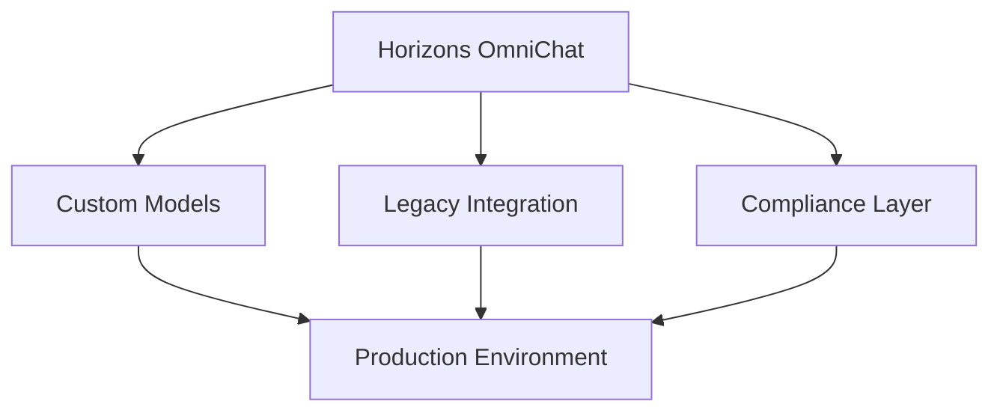

# Community Showcase

## Featured Implementations

### Enterprise Deployments

#### Financial Services
- **Global Investment Bank**
  - Hybrid deployment with custom models
  - 10,000+ daily users
  - Integration with internal knowledge base
  - Custom compliance controls

#### Healthcare
- **Regional Hospital Network**
  - AWS deployment with HIPAA compliance
  - Secure medical information processing
  - Integration with medical systems
  - Custom healthcare models

### Government & Public Sector

#### Smart City Initiative
- **European Municipality**
  - Local deployment for data sovereignty
  - Citizen service automation
  - Multi-language support
  - Privacy-first architecture

#### Educational Institution
- **Major University**
  - Hybrid deployment
  - Research assistance
  - Student support services
  - Custom academic models

## Community Projects

### Open Source Extensions

#### Data Analysis Plugin
- **GitHub**: [horizons-data-analysis](https://github.com/example/horizons-data-analysis)
- Advanced data visualization
- Custom reporting tools
- Integration with popular BI tools

#### Security Enhancement Suite
- **GitHub**: [horizons-security-suite](https://github.com/example/horizons-security-suite)
- Additional security controls
- Enhanced audit logging
- Compliance reporting tools

## Custom Integrations

### Enterprise Systems
- SAP Integration
- Salesforce Connector
- Microsoft Teams Bot
- Slack Integration

### Industry Solutions
- Legal Document Analysis
- Medical Record Processing
- Financial Advisory
- Educational Support

## Success Stories

### Case Study: Financial Services

#### Challenge
- Need for secure, compliant chatbot
- Integration with legacy systems
- Multi-language support
- High performance requirements

#### Solution


#### Results
- 85% reduction in response time
- 95% user satisfaction
- 60% cost reduction
- Full compliance maintenance

### Case Study: Healthcare

#### Challenge
- HIPAA compliance requirements
- Medical terminology support
- Integration with EHR systems
- 24/7 availability needs

#### Solution
- AWS deployment with enhanced security
- Custom medical models
- HL7 integration layer
- High availability setup

#### Results
- 90% accuracy in medical queries
- 75% reduction in wait times
- 100% HIPAA compliance
- Improved patient satisfaction

## Community Contributions

### Notable Extensions

#### Enhanced Security Module
- Advanced authentication
- Custom authorization rules
- Enhanced audit logging
- Security monitoring

#### Performance Optimization
- Query optimization
- Caching improvements
- Resource management
- Scaling tools

## Getting Started

### How to Submit Your Project

1. **Documentation**
   - Clear project description
   - Implementation details
   - Usage guidelines
   - Performance metrics

2. **Review Process**
   - Technical review
   - Security assessment
   - Documentation check
   - Community feedback

3. **Submission Steps**
```bash
# Fork the repository
git clone https://github.com/YOUR-USERNAME/horizons-omnichat.git

# Create showcase branch
git checkout -b showcase/your-project-name

# Add your project
# ... add your files ...

# Submit PR
git push origin showcase/your-project-name
```

## Recognition Program

### Categories

| Category | Criteria | Recognition |
|----------|----------|-------------|
| Innovation | Unique solutions | Featured showcase |
| Security | Enhanced security | Security badge |
| Performance | Optimization | Performance badge |
| Community | Active contribution | Community star |

### Benefits
- Featured in documentation
- Community recognition
- Priority support
- Early access to features

## Share Your Story

### Submission Guidelines

1. **Project Overview**
   - Project description
   - Implementation details
   - Technical architecture
   - Results and metrics

2. **Documentation**
   - Setup instructions
   - Configuration guide
   - Best practices
   - Troubleshooting

3. **Media Content**
   - Screenshots
   - Architecture diagrams
   - Performance graphs
   - Demo videos

## Next Steps

1. Review [Contributing Guide](../development/contributing.md)
2. Join [Community Discussions](https://github.com/evereven-tech/horizons-omnichat/discussions)
3. Submit your [Project Showcase](https://github.com/evereven-tech/horizons-omnichat/issues/new?template=showcase.md)


