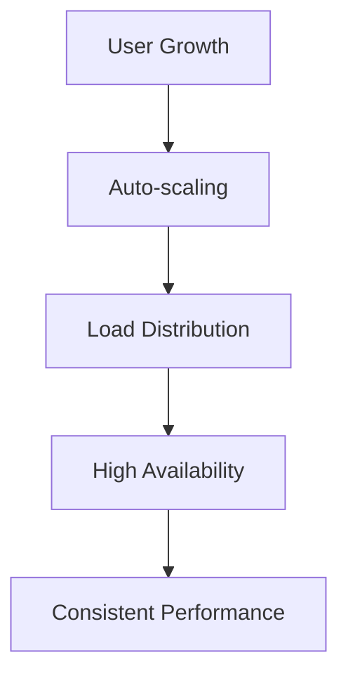

# Features That Make Horizons Stand Out

Discover why organizations choose Horizons OmniChat for their conversational AI needs. Our platform combines enterprise-grade capabilities with unmatched flexibility and control.

## 🎯 Core Capabilities

### Privacy-First Architecture
> 💡 **Tip**: Unlike other solutions that send your data to external services, Horizons keeps your data under your complete control.

Your data never leaves your infrastructure. Period. We've built Horizons with privacy at its core:
- Deploy entirely within your infrastructure
- Keep sensitive conversations private
- Maintain full data sovereignty
- Choose where your data resides

### Flexible Deployment Options
> ⚠️ **Important**: Start with Local mode to experiment, then scale up to Hybrid or AWS as your needs grow.

Deploy Horizons your way:
- **Local Mode**: Perfect for development and testing
  - Complete privacy
  - No cloud dependencies
  - Ideal for sensitive data
  
- **Hybrid Mode**: Best of both worlds
  - Local infrastructure control
  - Access to powerful cloud models
  - Cost-effective scaling
  
- **AWS Mode**: Enterprise-grade deployment
  - Full cloud infrastructure
  - Auto-scaling capabilities
  - High availability
  
- **Kubernetes Mode** (Coming Soon)
  - Cloud-agnostic deployment
  - Advanced orchestration
  - Enhanced scalability

## 🚀 Advanced Features

### Multi-Model Support
Mix and match models to suit your needs:

| Local Models (via Ollama) | Cloud Models (via AWS Bedrock) |
|--------------------------|-------------------------------|
| Llama 2 | Claude (Anthropic) |
| Mistral | Titan (Amazon) |
| TinyLlama | Jurassic (AI21) |
| Custom Models | Command (Cohere) |

> 💫 **Pro-tip**: Combine local models for sensitive data with cloud models for enhanced capabilities.

### Enterprise-Grade Security
> 🔒 **Security Note**: Every layer of Horizons is designed with security in mind.

- End-to-end encryption
- Role-based access control
- Audit logging
- Compliance features
- Network isolation
- Advanced authentication options

### Scalability & Performance
Built to grow with your needs:

- Automatic scaling (AWS mode)
- Load balancing
- Resource optimization
- Performance monitoring
- GPU acceleration support

## 💼 Business Benefits

### Cost Optimization
> 💰 **Cost Tip**: Start with Local mode for development, then scale with Hybrid mode for production.

- Pay only for what you use
- Mix local and cloud models
- Optimize resource usage
- Control cloud costs

### Integration Capabilities
Seamlessly connect with your ecosystem:

- REST API support
- WebSocket connections
- Custom authentication
- Enterprise system integration
- Extensible architecture

### Development Experience
> 🛠️ **Dev Tip**: Our comprehensive API documentation and SDKs make integration a breeze.

- Clear documentation
- API-first design
- Developer tools
- Custom model support
- Active community

## 🎯 Use Cases

### Enterprise Support
- Internal knowledge base
- Customer support automation
- Employee assistance
- Document analysis

### Development & Testing
- Model experimentation
- Prototype development
- Performance testing
- Integration testing

### Secure Deployments
- Healthcare applications
- Financial services
- Government systems
- Legal assistance

## 🚀 Getting Started

Ready to experience these features? Follow our quick start guides:

1. [Check Requirements](requirements.md)
2. [Installation Guide](installation.md)
3. [Deployment Options](../deployment/)

> 🌟 **Success Tip**: Our [Community Edition](../community/) is perfect for evaluating all these features in action.

## Enterprise Features

For organizations needing additional capabilities, our Enterprise Edition includes:

- Premium support
- Custom development
- Advanced security
- Compliance assistance
- Training & consulting
- SLA guarantees

> 🤝 **Enterprise Tip**: Contact our [Enterprise Team](../enterprise/) to discuss your specific needs.

## Next Steps

- [Try Horizons](installation.md)
- [Explore Deployments](../deployment/)
- [Join Our Community](../community/)
- [Contact Enterprise Sales](../enterprise/)


