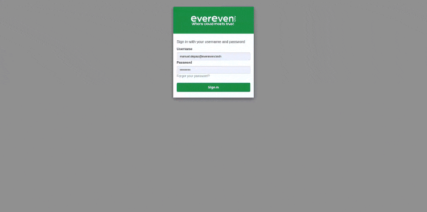

<div align="center">

# 🌅 Horizons: The OmniChat

Welcome to Horizons, a flexible and powerful chatbot platform that brings enterprise-grade LLM capabilities to your infrastructure.

<a href="#quick-start">Get Started</a> •
<a href="#documentation">Documentation</a> • 
<a href="#editions">Enterprise</a>

</div>



## Introduction

Imagine deploying an enterprise-grade chatbot with complete data control and unmatched flexibility. That's exactly what Horizons delivers.

> 💡 **Tip**: New to Horizons? Start with our [Getting Started Guide](getting-started/index.md) for a step-by-step introduction.

### Why Horizons?

In a world where data privacy and deployment flexibility are crucial, Horizons stands out by offering:

🔒 **Complete Privacy Control**
  
Your data never leaves your control. Unlike other solutions:
- Deploy on your infrastructure
- Keep your data under your control
- Operate without external service dependencies

⚠️ **Important**: Privacy isn't an add-on feature; it's core to our design.

🚀 **Deployment Flexibility**

We adapt Horizons to your needs, not the other way around:

- **Local Mode**: Perfect for development and testing
  > 💡 **Tip**: Ideal for teams starting out and need to experiment
- **Hybrid Mode**: Combine local resources with cloud services
  > ⚠️ **Note**: Requires AWS account for Bedrock features
- **AWS Mode**: Full cloud deployment
  > 💫 **Pro-tip**: Best choice for enterprise scalability
- **Kubernetes Mode**: For scalable infrastructures at any cloud platform
  > 🚧 **In Development**: Coming soon

## Quick Start

Ready to begin? Here are the basic commands:

```bash
# Clone the repository
git clone https://github.com/evereven-tech/horizons-omnichat.git
cd horizons

# Initialize the environment
make init

# Choose your deployment mode (Remember having properly set variables)
make local-up    # For local deployment
make hybrid-up   # For hybrid deployment
make aws-plan && make aws-apply   # For AWS deployment
```

> ⚠️ **Important**: Make sure to check the [system requirements](getting-started/requirements.md) before starting.

## Documentation

We've organized our documentation with your learning journey in mind:

📚 **Getting Started**
- [Getting Started Guide](getting-started/index.md): Your starting point
- [Requirements](getting-started/requirements.md): What you need
- [Features](getting-started/features.md): Step by step guide

🏗️ **Deployment Options**
- [Local](deployment/local.md): For development and testing
- [Hybrid](deployment/hybrid.md): Enhance local capabilities adding more aws models
- [AWS](deployment/aws.md): For business with Enterprise scale
- [Kubernetes](deployment/kubernetes.md): For business with Enterprise scale at any cloud platform

> 💡 **Tip**: Start with local mode to familiarize yourself with the platform before moving to more complex deployments.

## Editions

Horizons is available in three editions to suit different needs:

| **Community** | **Enterprise** |
|-----------------|------------|
| Open Source | Premium Support |
| Local or Cloud Deployment | Guaranteed SLA |
| Community Support | Professional Services |
| [Get Started](getting-started/index.md) | [Enterprise](enterprise/index.md) |

> 🌟 **Pro-tip**: Community Edition is perfect for starting and evaluating the platform.

## Built With

Horizons stands on the shoulders of giants:

- [Ollama](https://github.com/ollama/ollama): Local model engine
- [Open WebUI](https://github.com/open-webui/open-webui): User interface
- [AWS Bedrock Access Gateway](https://github.com/aws-samples/bedrock-access-gateway): AWS integration

## Need Help?

- 🤔 Have questions? Visit our [FAQ](community/faq.md)
- 🐛 Found a bug? Open an [Issue](https://github.com/evereven-tech/horizons-omnichat/issues)
- 💡 Looking for inspiration? Check our [Use Cases](community/showcase.md)
- 🤝 Need enterprise support? [Contact Us](enterprise/support.md)

---

<div align="center">
Built with 💚 by <a href="https://www.evereven.tech">evereven</a>
</div>
