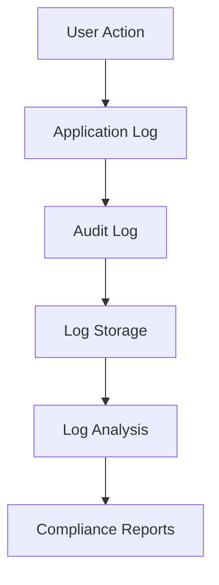

# Compliance Guide

## Overview

Horizons OmniChat has been architected from the ground up with compliance and security in mind, adhering to industry-leading standards and best practices. Our platform implements comprehensive controls and safeguards that align with major international compliance frameworks, making it suitable for organizations with strict regulatory requirements.

## Regulatory Compliance & Industry Standards

### General Data Protection Regulation (GDPR)

Our GDPR compliance framework ensures that organizations can maintain full control over their data processing activities and fulfill their obligations as data controllers:

- **Data Privacy by Design**
  - Privacy-first architecture ensuring data protection at every layer
  - Configurable data retention policies with automated enforcement
  - Granular consent management system
  - Built-in data minimization principles

- **Data Subject Rights Management**
  - Automated subject access request handling
  - Built-in tools for data portability
  - Streamlined processes for right to erasure
  - Comprehensive data inventory and mapping

- **Technical Measures**
  - End-to-end encryption for all personal data
  - Pseudonymization capabilities
  - Robust access controls and authentication
  - Detailed audit trails for all data processing

### System and Organization Controls (SOC 2)

Our platform implements controls aligned with all five SOC 2 trust service criteria:

- **Security**
  - Multi-layered security architecture
  - Advanced threat detection and prevention
  - Comprehensive security monitoring
  - Regular security assessments and penetration testing

- **Availability**
  - High-availability architecture
  - Automated failover capabilities
  - Robust backup and recovery procedures
  - Performance monitoring and alerting

- **Processing Integrity**
  - Input validation and error checking
  - Process monitoring and quality controls
  - Data integrity verification
  - Audit trails for all processing activities

- **Confidentiality**
  - Data classification and handling controls
  - Encryption at rest and in transit
  - Access control based on least privilege
  - Secure data disposal procedures

- **Privacy**
  - Privacy impact assessments
  - Data collection limitations
  - Purpose specification controls
  - Privacy notice management

### ISO 27001 Information Security Management

Our security controls framework is mapped to ISO 27001 requirements:

- **Information Security Policies**
  - Comprehensive policy framework
  - Regular review and updates
  - Integration with operational procedures
  - Employee awareness and training

- **Asset Management**
  - Complete asset inventory
  - Data classification
  - Asset handling procedures
  - Ownership and responsibility assignment

- **Access Control**
  - Role-based access control (RBAC)
  - Regular access reviews
  - Privileged access management
  - Strong authentication requirements

### Esquema Nacional de Seguridad (ENS)

For organizations operating in Spain, we provide specific controls aligned with ENS requirements:

- **Security Categorization**
  - System categorization framework
  - Impact assessment tools
  - Risk analysis methodology
  - Control selection guidance

- **Security Measures**
  - Technical controls implementation
  - Organizational measures
  - Procedural controls
  - Personnel security

### Industry-Specific Compliance

#### Healthcare (HIPAA)
Our Enterprise edition includes specific controls for healthcare organizations:

- **Privacy Rule Compliance**
  - PHI handling controls
  - Minimum necessary access
  - Patient rights management
  - Notice of privacy practices

- **Security Rule Implementation**
  - Administrative safeguards
  - Physical security controls
  - Technical security measures
  - Encryption requirements

#### Financial Services
For financial institutions, we provide controls aligned with:

- **PCI DSS**
  - Cardholder data protection
  - Vulnerability management
  - Access control measures
  - Security monitoring

- **FINRA**
  - Communications monitoring
  - Record keeping
  - Supervisory controls
  - Data retention

## Implementation Guidelines

### 1. Data Protection

#### Local/Hybrid Mode
```yaml
Encryption:
  - Database encryption
  - File system encryption
  - TLS for communications

Access Controls:
  - Role-based access
  - Authentication required
  - Session management
```

#### AWS Mode
```yaml
Encryption:
  - KMS encryption
  - TLS termination
  - VPC encryption

Access Controls:
  - Cognito authentication
  - IAM roles
  - Security groups
```

### 2. Audit Requirements

#### Audit Logging


#### Log Types
1. Authentication events
2. Data access
3. Configuration changes
4. Security events
5. Model usage

### 3. Documentation Requirements

#### Required Documentation
- Security policies
- Privacy policies
- Incident response plans
- Business continuity plans
- Data flow diagrams
- Risk assessments

#### Maintenance Schedule
- Annual policy review
- Quarterly risk assessments
- Monthly security reviews
- Weekly backup verification

## Next Steps

1. Review [Security Architecture](../architecture/security.md)
2. Implement [Security Controls](../operations/security.md)
3. Configure [Monitoring](../operations/monitoring.md)
4. Set up [Audit Logging](../operations/configuration.md#audit-logging)


