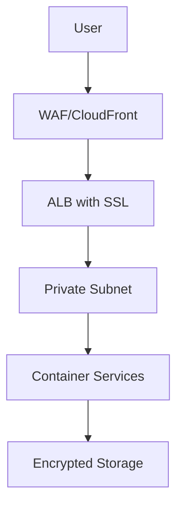

# Security Overview

## Introduction

Horizons OmniChat is designed with security-first principles across all deployment modes. This overview provides a comprehensive look at our security architecture and practices.

## Security Architecture Layers

### 1. Application Security

#### Authentication & Authorization
- Multi-factor authentication (AWS Mode)
- Role-based access control (RBAC)
- Session management
- JWT token validation
- API key authentication

#### Data Protection
- End-to-end encryption
- Data at rest encryption
- Secure secret management
- Input/Output validation

### 2. Network Security

#### Infrastructure Protection


#### Security Controls
- TLS 1.3 encryption
- Network segmentation
- Security groups
- NACLs
- Private subnets
- VPC endpoints

### 3. Operational Security

#### Access Management
- Principle of least privilege
- Regular access reviews
- Secure credential rotation
- Audit logging

#### Monitoring & Response
- Real-time security monitoring
- Incident response procedures
- Automated alerts
- Security event logging

## Deployment Mode Security Features

### Local Mode
- Basic authentication
- Local network isolation
- File system encryption
- Secure configuration storage

### Hybrid Mode
All Local Mode features plus:
- AWS IAM integration
- Bedrock API security
- Cross-service authentication
- Secure cloud communication

### AWS Mode
All Hybrid Mode features plus:
- AWS WAF protection
- AWS Shield (optional)
- AWS Cognito authentication
- AWS KMS encryption
- VPC security
- AWS CloudTrail auditing

## Security Best Practices

### 1. Access Control
```yaml
Principles:
  - Least privilege access
  - Role-based permissions
  - Regular access reviews
  - Strong password policies
  - Session management
```

### 2. Data Security
```yaml
Measures:
  - Encryption at rest
  - Encryption in transit
  - Secure key management
  - Data classification
  - Retention policies
```

### 3. Network Security
```yaml
Controls:
  - Network segmentation
  - Firewall rules
  - TLS encryption
  - VPC isolation
  - Security groups
```

## Compliance & Standards

### Supported Frameworks
- GDPR compliance features
- HIPAA readiness (Enterprise)
- SOC 2 controls (Enterprise)
- ISO 27001 alignment

### Security Certifications
- AWS Security Best Practices
- Container Security Standards
- API Security Guidelines

## Security Features Matrix

| Feature | Local | Hybrid | AWS |
|---------|-------|--------|-----|
| Authentication | Basic | Basic + AWS IAM | Cognito + MFA |
| Encryption | Local | Local + AWS | Full AWS |
| Network Security | Basic | Enhanced | Advanced |
| Monitoring | Local | Hybrid | CloudWatch |
| Compliance | Basic | Enhanced | Full |

## Security Guidelines

### 1. Initial Setup
- Change default credentials
- Configure SSL/TLS
- Set up authentication
- Enable audit logging

### 2. Ongoing Maintenance
- Regular updates
- Security patches
- Access reviews
- Backup verification

### 3. Monitoring
- System logs
- Security events
- Performance metrics
- User activity

## Incident Response

### 1. Detection
- Automated monitoring
- Alert systems
- User reporting
- System checks

### 2. Response
- Incident classification
- Containment procedures
- Investigation process
- Recovery steps

### 3. Prevention
- Root cause analysis
- Security improvements
- Policy updates
- Team training

## Security Documentation

### Required Documentation
1. Security Policies
2. Access Control Procedures
3. Incident Response Plan
4. Disaster Recovery Plan

### Security Procedures
1. User Management
2. Key Rotation
3. Backup Verification
4. Security Audits

## Next Steps

1. Review detailed [Security Architecture](../architecture/security.md)
2. Implement [Security Controls](security/controls.md)
3. Configure [Security Monitoring](../operations/monitoring.md)
4. Review [Compliance Requirements](compliance.md)


