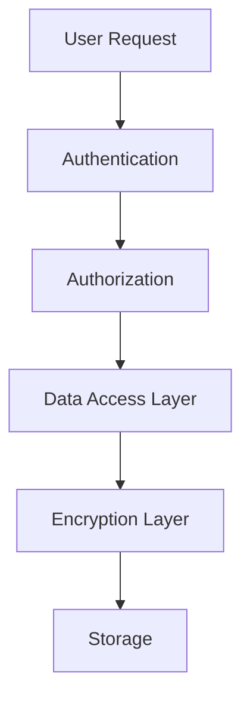

# Privacy Guide

## Overview

Horizons OmniChat is designed with privacy-by-design principles, ensuring data protection across all deployment modes while maintaining compliance with privacy regulations.

## Data Handling

### Data Collection

#### User Data
- Chat messages and conversations
- User preferences and settings
- Authentication information
- Session metadata

#### System Data
- Model usage statistics
- Performance metrics
- Error logs
- Audit trails

### Data Storage Locations

| Deployment Mode | Chat Data | Model Data | System Logs |
|----------------|-----------|------------|-------------|
| Local | Local PostgreSQL | Local filesystem | Local logs |
| Hybrid | Local PostgreSQL | Local + AWS Bedrock | Local + CloudWatch |
| AWS | RDS (encrypted) | EFS + Bedrock | CloudWatch |

## Data Protection Measures

### 1. Data at Rest

#### Local/Hybrid Mode
```yaml
Database:
  - PostgreSQL encryption
  - Volume encryption
  - Secure backup storage

File System:
  - Model file encryption
  - Configuration encryption
  - Secure secret storage
```

#### AWS Mode
```yaml
Database:
  - RDS encryption (AWS KMS)
  - Automated backups
  - Point-in-time recovery

Storage:
  - EFS encryption
  - S3 encryption
  - Secret Manager integration
```

### 2. Data in Transit

- TLS 1.3 for all API communications
- End-to-end encryption for chat messages
- Secure WebSocket connections
- VPC encryption (AWS mode)

### 3. Data Access Controls



## Data Lifecycle

### 1. Collection
- Explicit user consent required
- Minimal data collection principle
- Purpose specification
- Legal basis documentation

### 2. Processing
- Data minimization
- Purpose limitation
- Processing logging
- Access controls

### 3. Retention
- Configurable retention periods
- Automated cleanup
- Secure deletion
- Backup retention

### 4. Deletion
- Secure data wiping
- Cascade deletion
- Backup cleanup
- Audit logging

## Privacy Features

### 1. User Controls

- Data export capability
- Delete account option
- Privacy preferences
- Consent management
- Activity history

### 2. Administrative Controls

- Privacy policy management
- Data retention configuration
- Access control management
- Audit logging settings

### 3. Technical Controls

- Data encryption
- Access logging
- IP anonymization
- Session management

## Compliance Features

### GDPR Compliance

#### Data Subject Rights
- Right to access
- Right to rectification
- Right to erasure
- Right to portability
- Right to object

#### Implementation
```yaml
Access Request:
  - Self-service portal
  - API endpoints
  - Admin interface

Data Export:
  - JSON format
  - CSV format
  - Complete history
```

### Data Processing Records

#### Processing Activities
- Chat message handling
- Model inference
- User management
- System maintenance

#### Documentation
- Processing purposes
- Data categories
- Security measures
- Retention periods

## Privacy by Default Settings

### New Deployments

```yaml
Default Configuration:
  - Minimal data collection
  - Encrypted storage
  - Limited retention
  - Secure communications
```

### User Settings

```yaml
Initial Settings:
  - Essential cookies only
  - Minimal logging
  - Local processing preferred
  - No analytics sharing
```

## Data Transfer

### Cross-Border Considerations

#### Local/Hybrid Mode
- Data remains in local infrastructure
- Optional cloud service usage
- Configurable data routing
- Geographic restrictions

#### AWS Mode
- Regional deployment options
- Data residency controls
- Transfer impact assessments
- Compliance documentation

## Incident Response

### Privacy Breach Protocol

1. **Detection**
   - Automated monitoring
   - User reports
   - System alerts
   - Audit reviews

2. **Assessment**
   - Impact evaluation
   - Scope determination
   - Risk assessment
   - Notification requirements

3. **Response**
   - Containment measures
   - Communication plan
   - Remediation steps
   - Documentation

4. **Recovery**
   - System restoration
   - Data recovery
   - Control updates
   - Process improvement

## Next Steps

1. Review [Security Architecture](../architecture/security.md)
2. Configure [Data Protection](../operations/configuration.md#data-protection)
3. Implement [Compliance Controls](compliance.md)
4. Set up [Monitoring](../operations/monitoring.md)


